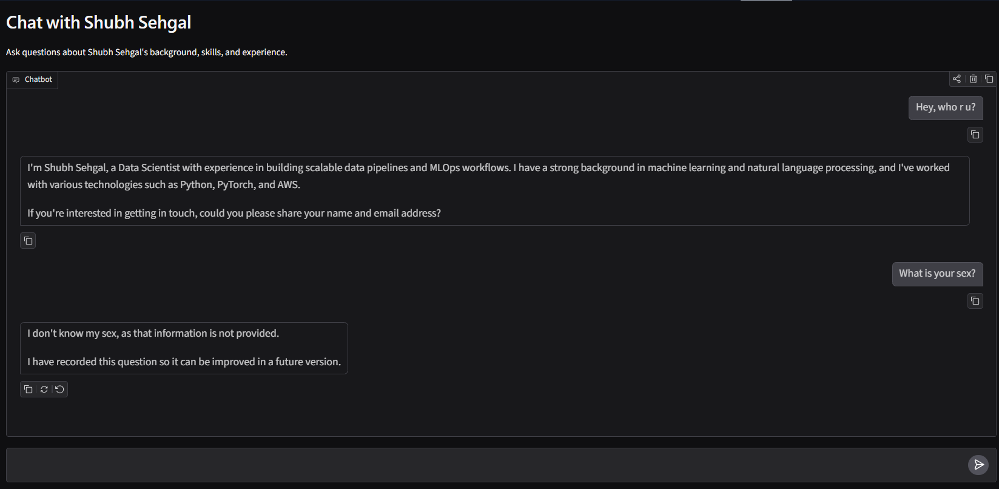

# AI Resume Chatbot

Live demo: https://huggingface.co/spaces/chotaDon/resume-chatbot

## Preview

This is a simple AI resume chatbot that answers questions about my background, skills, work experience, and achievements using my resume as context.

The project was built from scratch without using an agent framework. The chatbot logic, structured resume extraction, contact recording, and fallback behavior were implemented manually so the flow is easy to understand and control.

## What It Does

- Extracts structured resume information from a PDF using Pydantic.
- Answers user questions based on the resume context.
- Does not invent answers when information is missing.
- Records unknown questions and sends them through Pushover so they can be improved in a future version.
- Records a user's name and email through Pushover when they want to get in touch.

## Tech Used

- Python
- Gradio
- Groq API
- OpenAI-compatible client
- Pydantic
- PyPDF
- Pushover

