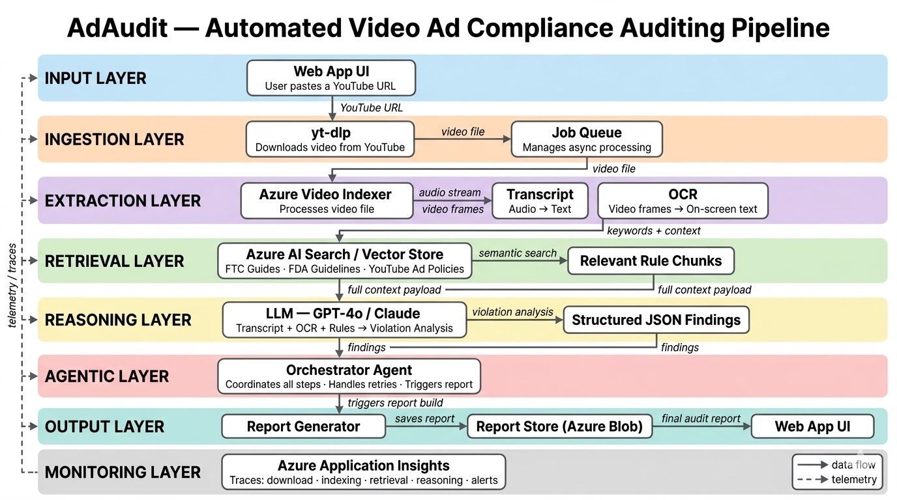

# AdAudit — Automated Video Ad Compliance Auditor

> *Paste a YouTube URL. Get a legal compliance report in minutes.*

> Head over to the **Compliance-Ingestion-system** folder in this for the code and walkthrough of how this was built.

---

## What is AdAudit?

Every video advertisement — whether a Nike commercial, a skincare influencer post, or a DTC supplement brand's YouTube pre-roll — is subject to a web of regulatory rules. The FTC Endorsement Guides, FDA advertising standards, and platform-specific policies dictate what brands can say, how they must disclose sponsorships, and which health or performance claims require substantiation. Violating these rules can result in warning letters, fines, or forced takedowns.

Today, compliance review is done manually: a legal team watches the ad, cross-references the relevant guidelines, and produces a written report. It is slow, expensive, and does not scale.

**AdAudit automates this entire process end-to-end.**

You paste a YouTube URL. AdAudit downloads the video, extracts everything said (transcript) and everything shown on screen (OCR), retrieves the applicable compliance rules from a curated regulatory document store, and sends all of it to an LLM that reasons over the content and flags violations, misleading claims, and missing disclosures. The output is a structured audit report — ready to file internally or share with a client — in minutes, not weeks.

---

## How It Works



```
YouTube URL
    │
    ▼
Video Download (yt-dlp)
    │
    ▼
Azure Video Indexer
    ├── Transcript  →  what was said
    └── OCR         →  what was shown on screen
    │
    ▼
Azure AI Search
    └── Retrieves relevant rules from compliance document store
        (e.g., "sunscreen" → FDA OTC drug claim guidelines)
    │
    ▼
LLM Reasoning Layer
    └── Compares transcript + OCR against retrieved compliance rules
        and identifies violations, missing disclosures, and risky claims
    │
    ▼
Audit Report
    ├── ✅  Compliant claims
    ├── ❌  Violations with rule citations
    └── ⚠️  Missing or incomplete disclosures
    │
    ▼
Azure Application Insights
    └── Monitors every step — download, indexing, retrieval, reasoning
```

### Step-by-step

1. **Ingest** — The user submits a YouTube URL. `yt-dlp` downloads the video file for processing.

2. **Extract** — The video is sent to Azure Video Indexer, which returns a full spoken transcript and OCR output capturing all on-screen text (product names, disclaimers, price claims, etc.).

3. **Retrieve** — The extracted content is used as a query against Azure AI Search, which holds a curated index of compliance documents (FTC Endorsement Guides, FDA guidelines, platform advertising policies, and more). Semantically relevant rules are retrieved — for example, a video mentioning "clinically proven" will surface FTC and FDA substantiation requirements.

4. **Reason** — The transcript, OCR output, and retrieved compliance rules are passed to an LLM. The model reads the ad's content against the rules and identifies: which claims are compliant, which violate specific guidelines, and which required disclosures (e.g., `#ad`, ingredient warnings, efficacy disclaimers) are absent.

5. **Report** — An agentic workflow assembles the findings into a structured compliance report with pass/fail status per claim, severity levels, and direct citations to the violated rules.

6. **Monitor** — Azure Application Insights traces every stage of the pipeline. If anything fails — a download timeout, an indexer error, a retrieval miss — the exact failure point is logged for debugging and alerting.

---

## Why This Matters

| Without AdAudit | With AdAudit |
|---|---|
| Legal team watches ad manually | Automated extraction of transcript + screen text |
| Cross-references PDFs by hand | Semantic retrieval from compliance document store |
| Report takes days to weeks | Report generated in minutes |
| Expensive legal billable hours | Scalable SaaS workflow |
| Reactive — caught after launch | Proactive — audited before publishing |

---

## Compliance Documents Supported

- FTC Endorsement Guides (16 CFR Part 255)
- FDA Guidelines on Health Claims in Advertising
- YouTube Advertising Policies
- *(Extensible — any regulatory PDF can be indexed)*

---

## Tech Stack

| Layer | Technology |
|---|---|
| Video Download | `yt-dlp` |
| Transcription + OCR | Azure Video Indexer |
| Compliance Document Store | Azure AI Search |
| LLM Reasoning | GPT-4o / Claude |
| Agentic Workflow | LangChain / custom agent |
| Monitoring | Azure Application Insights |

---

## Disclaimer

AdAudit is a compliance assistance tool, not a substitute for legal counsel. Reports generated by this system do not constitute legal advice. Always consult a qualified attorney for final compliance determinations.